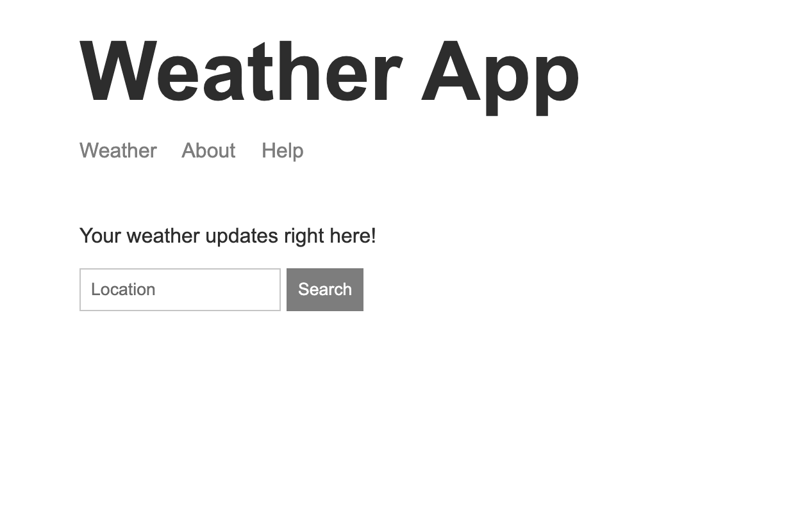

# Node.js Weather App

### Description

This application uses the [weatherstack](https://weatherstack.com/) and [mapbox](https://www.mapbox.com/) APIs to provide the user with weather information for any location they enter.




### Deployment link

- https://katieloesch-weather-app-a328b6689b00.herokuapp.com/

### Installation

- package manager used: npm (v10.8.1)

  - https://www.npmjs.com/

- to install dependencies

```zsh
npm install
```

- after installing depencies, start the app by running

```zsh
npm run dev
```

- dependencies

  - express: (v4.19.2),
    - npm: https://www.npmjs.com/package/express
    - repo: https://github.com/expressjs/express
    - homepage: https://expressjs.com/
  - hbs (v4.2.0),
    - npm: https://www.npmjs.com/package/hbs
    - repo:https://github.com/pillarjs/hbs
  - postman-request (v2.88.1-postman.31),
    - npm: https://www.npmjs.com/package/postman-request
    - repo: https://github.com/postmanlabs/postman-request

- apis

  - weatherstack

    - https://weatherstack.com/
    - used to obtain weather information based on location coordinates

  - mapbox
    - https://www.mapbox.com/
    - used to obtain location coordinates based on a location string entered by user
